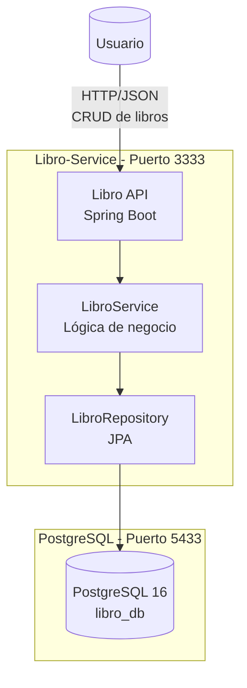
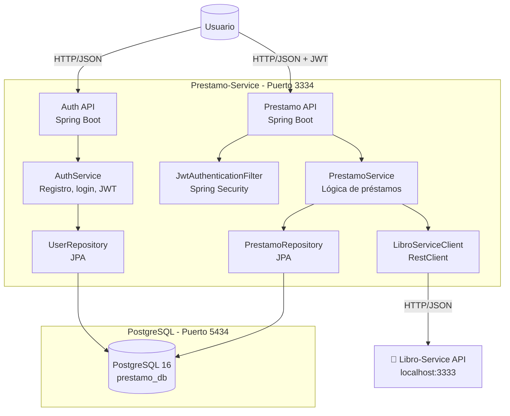

# Arquitectura de Lexicon

## Diagrama C2 - Contenedores por Microservicio

### 1. Libro-Service (docker-compose.yml)

Este diagrama muestra los contenedores del servicio de libros.

**Explicación:**
- `Libro API`: expone endpoints CRUD para gestionar el catálogo de libros.
- `LibroService`: contiene la lógica de negocio para consulta, creación, actualización y estado de libros.
- `LibroRepository`: capa de persistencia JPA.
- `PostgreSQL libro_db` (docker-compose.yml): almacena la tabla `libros` en el puerto 5433 (acceso local).

---

### 2. Prestamo-Service (docker-compose.yml)

Este diagrama muestra los contenedores del servicio de préstamos.

**Explicación:**
- `Auth API`: endpoints `/api/auth/register`, `/api/auth/login`, `/api/auth/validate`.
- `Prestamo API`: endpoints `/api/prestamos`, `/api/prestamos/usuario`, `/api/prestamos/{id}`, `/api/prestamos/{id}/devolucion`.
- `AuthService`: gestiona usuarios y tokens JWT.
- `PrestamoService`: registra préstamos, valida disponibilidad y realiza devoluciones.
- `LibroServiceClient`: cliente REST que se comunica con Libro-Service (comunicación inter-servicios).
- `JwtAuthenticationFilter`: asegura que solo peticiones con JWT válido pasen a los endpoints protegidos.
- `PostgreSQL prestamo_db` (docker-compose.yml): almacena tablas `users` y `prestamos` en el puerto 5434 (acceso local).

---

## Flujo de préstamo simplificado (Integración entre servicios)

1. El usuario obtiene un JWT desde `Auth API` (Prestamo-Service).
2. El usuario solicita un préstamo a `Prestamo API` con JWT.
3. `PrestamoService` usa `LibroServiceClient` para consultar la disponibilidad en `Libro-Service`.
4. Si el libro está disponible, se guarda el préstamo en `prestamo_db` y se actualiza la disponibilidad en `libro_db`.

---

## Escalabilidad

Cada microservicio:
- Es **independiente** y tiene su propio `docker-compose.yml`.
- Posee su **propia base de datos PostgreSQL** en un puerto único.
- Puede desplegarse **sin dependencia** del otro (excepto Prestamo-Service que requiere Libro-Service en runtime).
- Puede escalarse **independientemente** según demanda.
- Usa el preview de Markdown o el soporte de Mermaid para visualizar el diagrama.
- Si necesitas un diagrama C2 más detallado con componentes internos adicionales, puedo agregarlo.
