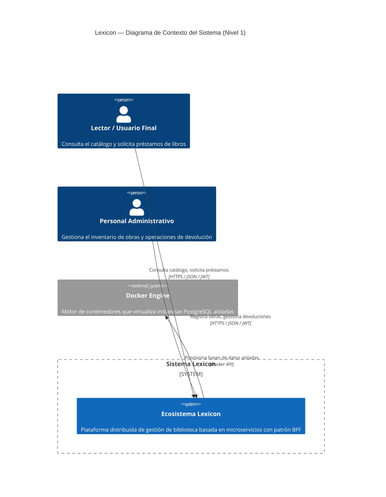
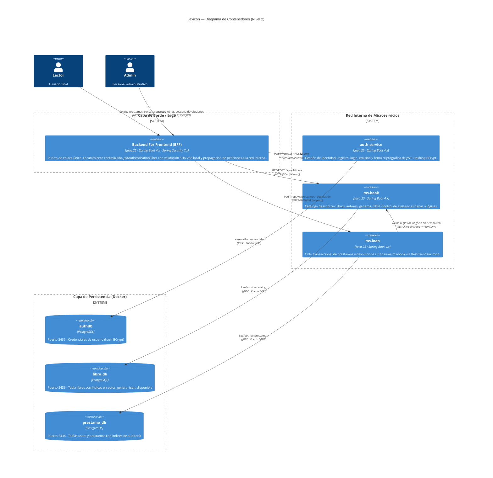
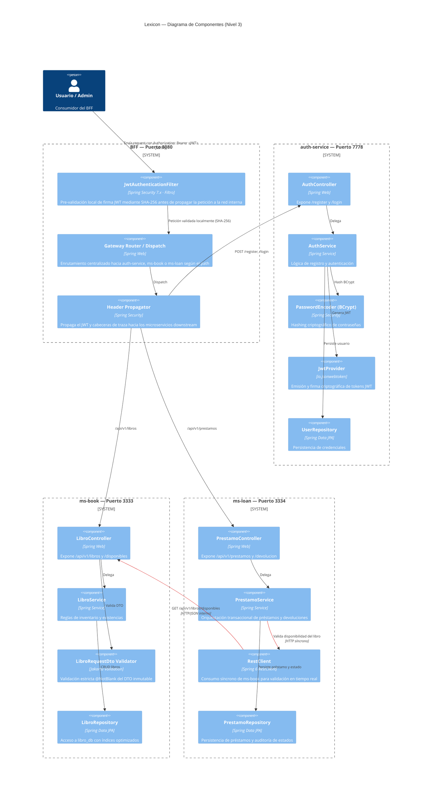
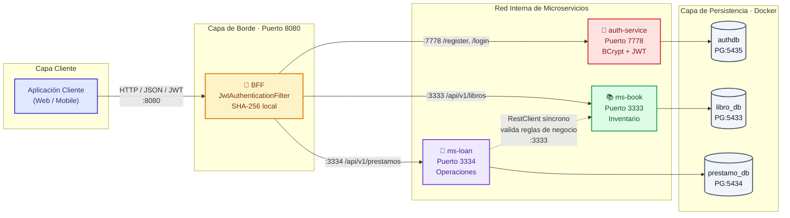
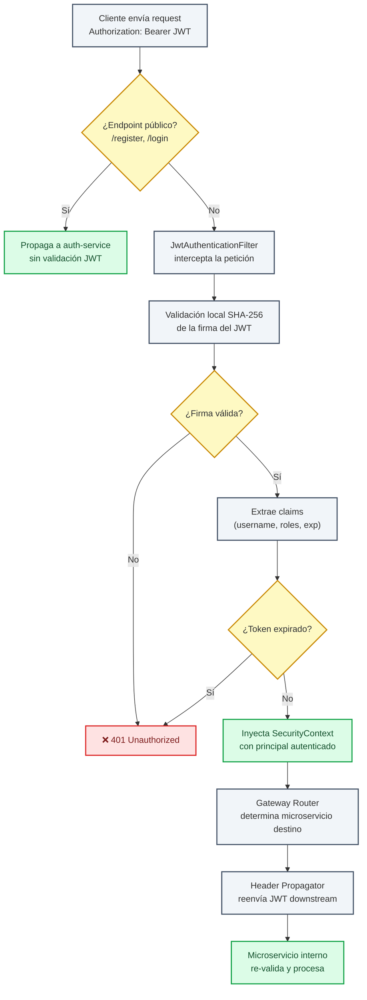
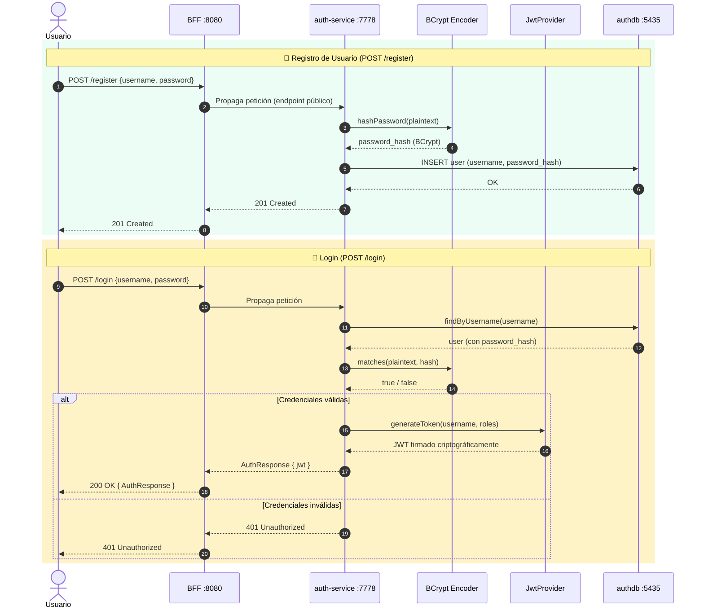
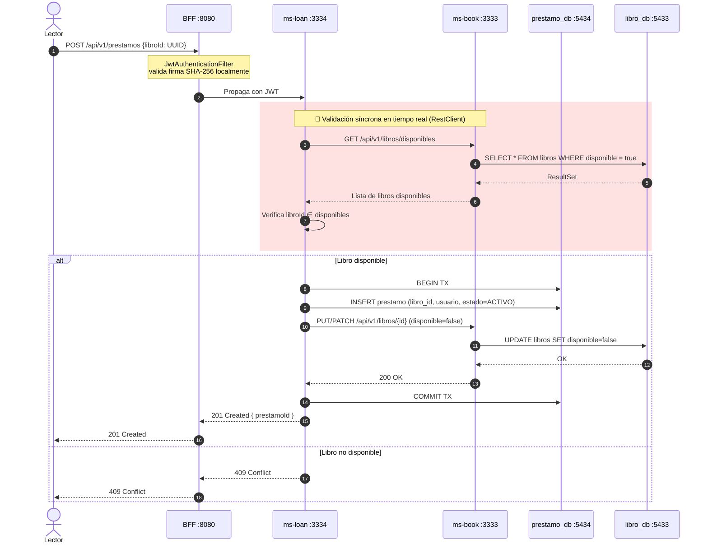
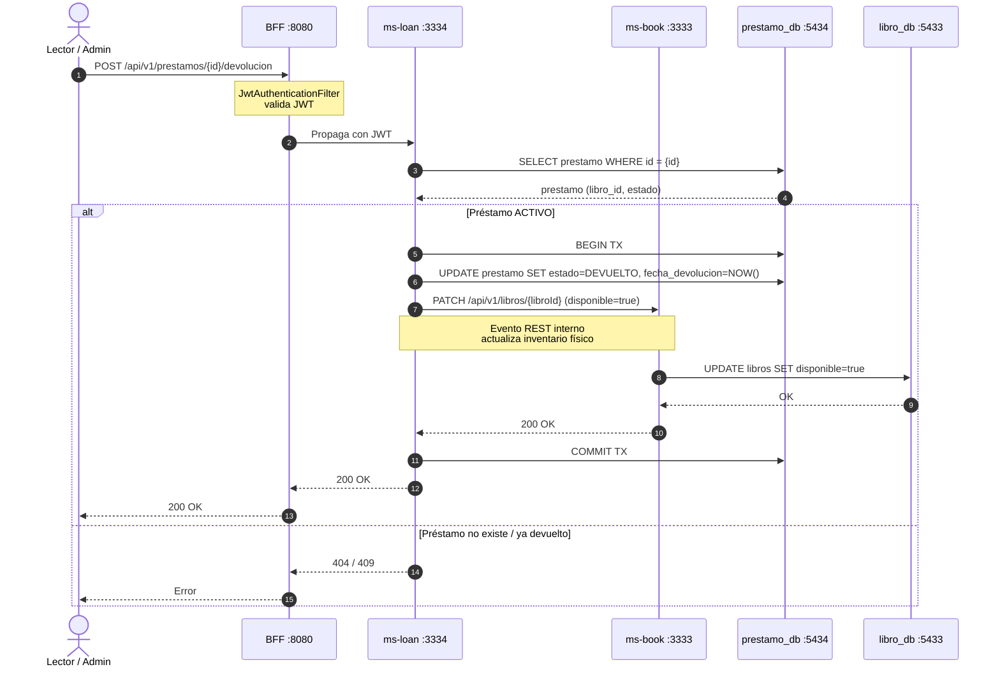
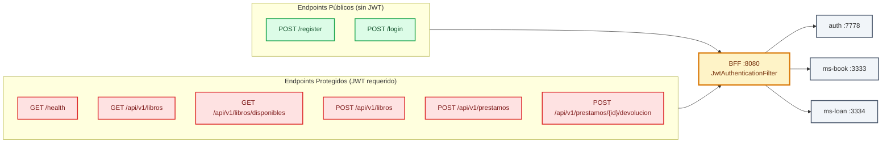
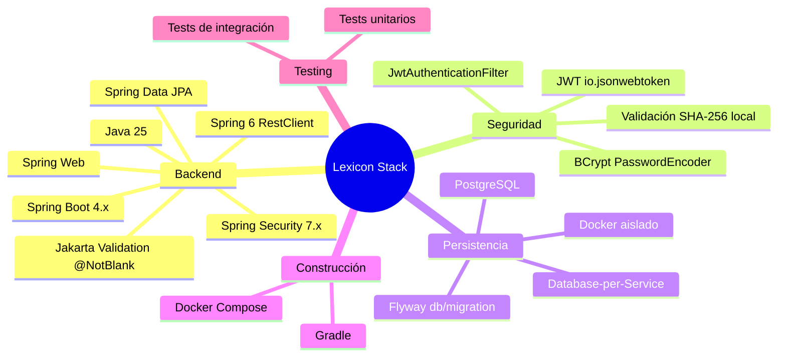

# Lexicon — Diagramas de Arquitectura Técnica

> Documentación visual técnica y profesional del ecosistema de microservicios **Lexicon** (Sistema de Gestión de Biblioteca con patrón **BFF**).
>
> Todos los diagramas utilizan **Mermaid** y se renderizan automáticamente en **GitHub**, **GitLab** y **Mermaid Live Editor** (https://mermaid.live).
>
> Metodología: **C4 Model** (Contexto → Contenedor → Componente) complementada con diagramas de secuencia y modelo de datos.

---

## Tabla de Contenidos

1. [Nivel 1 — Diagrama de Contexto del Sistema (C4)](#nivel-1--diagrama-de-contexto-del-sistema-c4)
2. [Nivel 2 — Diagrama de Contenedores (C4)](#nivel-2--diagrama-de-contenedores-c4)
3. [Nivel 3 — Diagrama de Componentes (C4)](#nivel-3--diagrama-de-componentes-c4)
4. [Topología de Red y Puertos](#topología-de-red-y-puertos)
5. [Flujo de Seguridad — JWT y BFF](#flujo-de-seguridad--jwt-y-bff)
6. [Diagrama de Secuencia — Autenticación (Registro / Login)](#diagrama-de-secuencia--autenticación-registro--login)
7. [Diagrama de Secuencia — Préstamo de Libro](#diagrama-de-secuencia--préstamo-de-libro)
8. [Diagrama de Secuencia — Devolución de Libro](#diagrama-de-secuencia--devolución-de-libro)
9. [Modelo de Datos — Database-per-Service](#modelo-de-datos--database-per-service)
10. [Matriz de Endpoints Públicos del BFF](#matriz-de-endpoints-públicos-del-bff)
11. [Stack Tecnológico](#stack-tecnológico)

---

## Nivel 1 — Diagrama de Contexto del Sistema (C4)

Vista de alto nivel: actores externos y el sistema Lexicon como una única caja negra.



---

## Nivel 2 — Diagrama de Contenedores (C4)

Desglose del ecosistema en sus contenedores desplegables independientes. Cada microservicio posee su propia base de datos (**Database-per-Service**), garantizando bajo acoplamiento y alta cohesión.



---

## Nivel 3 — Diagrama de Componentes (C4)

Vista interna de cada contenedor, mostrando los componentes clave (filtros, controladores, servicios, repositorios) y sus responsabilidades técnicas.



---

## Topología de Red y Puertos

Mapa de puertos expuestos por contenedor y dirección de las dependencias síncronas.



---

## Flujo de Seguridad — JWT y BFF

Detalle del pipeline de seguridad implementado por el **BFF** como único punto de entrada:



---

## Diagrama de Secuencia — Autenticación (Registro / Login)

Flujo completo del proceso de identidad, desde el registro hasta la emisión del JWT.



---

## Diagrama de Secuencia — Préstamo de Libro

Flujo transaccional síncrono que involucra al BFF, ms-loan y la validación en tiempo real contra ms-book vía **RestClient**.



---

## Diagrama de Secuencia — Devolución de Libro

Flujo de cierre del ciclo transaccional: actualiza el estado del préstamo y restaura el inventario mediante eventos REST internos.



---

## Modelo de Datos — Database-per-Service

Cada microservicio posee su propio esquema de base de datos aislado, gestionado mediante migraciones evolutivas con **Flyway** (`db/migration/`).

```mermaid
erDiagram
    %% ===== authdb (auth-service · Puerto 5435) =====
    USERS_AUTH {
        uuid id PK
        string username UK
        string password_hash "BCrypt"
        timestamp created_at
        timestamp updated_at
    }

    %% ===== libro_db (ms-book · Puerto 5433) =====
    LIBROS {
        uuid id PK
        string titulo
        string autor "INDEX"
        string genero "INDEX"
        string isbn "INDEX"
        boolean disponible "INDEX"
        timestamp created_at
        timestamp updated_at
    }

    %% ===== prestamo_db (ms-loan · Puerto 5434) =====
    USERS_LOAN {
        uuid id PK
        string username UK "INDEX"
        string password_hash
        timestamp created_at
        timestamp updated_at
    }

    PRESTAMOS {
        uuid id PK
        uuid libro_id "INDEX (referencia lógica, no FK)"
        string usuario_username "INDEX"
        timestamp fecha_prestamo
        timestamp fecha_devolucion
        string estado "INDEX: ACTIVO | DEVUELTO"
        timestamp created_at
        timestamp updated_at
    }

    USERS_LOAN ||--o{ PRESTAMOS : "solicita"
    LIBROS ..> PRESTAMOS : "referencia lógica<br/>(no hay FK física:<br/>Database-per-Service)"
```

> **Nota de diseño:** La relación `PRESTAMOS.libro_id → LIBROS.id` es **lógica**, no física. Al adoptar el patrón *Database-per-Service*, no existen claves foráneas cross-base; la integridad referencial se garantiza en tiempo de ejecución mediante la validación síncrona de `ms-loan` contra `ms-book` vía `RestClient`.

---

## Matriz de Endpoints Públicos del BFF

Todos los endpoints externos se exponen **exclusivamente** a través del BFF (Puerto `8080`). La red interna de microservicios permanece aislada.



### Detalle de Endpoints

| Método | Endpoint | Descripción | Autenticación | Microservicio Backend |
|:---:|---|---|:---:|---|
| `POST` | `/register` | Registro inicial de usuarios | ❌ Público | `auth-service` |
| `POST` | `/login` | Inicia sesión, retorna `AuthResponse` con JWT | ❌ Público | `auth-service` |
| `GET` | `/health` | Estado e infraestructura del BFF | ✅ JWT | BFF (local) |
| `GET` | `/api/v1/libros` | Lista catálogo total (`?autor=X&genero=Y`) | ❌ Público | `ms-book` |
| `GET` | `/api/v1/libros/disponibles` | Lista obras con existencias lógicas | ❌ Público | `ms-book` |
| `POST` | `/api/v1/libros` | Registra nueva obra (`LibroRequestDto`) | ❌ Público | `ms-book` |
| `POST` | `/api/v1/prestamos` | Solicita préstamo (`{"libroId": "<UUID>"}`) | ✅ JWT | `ms-loan` |
| `POST` | `/api/v1/prestamos/{id}/devolucion` | Registra retorno físico | ✅ JWT | `ms-loan` |

---

## Stack Tecnológico



---

## Resumen de Decisiones Arquitectónicas

| Decisión | Justificación Técnica |
|---|---|
| **Patrón BFF** | Punto único de entrada que aísla la red interna, centraliza seguridad (JwtAuthenticationFilter) y desacopla el frontend de la topología de microservicios. |
| **Database-per-Service** | Bajo acoplamiento y alta cohesión: cada microservicio posee su propio PostgreSQL, evitando bloqueos cruzados y permitiendo escalado independiente. |
| **Validación SHA-256 local en BFF** | Pre-validación criptográfica de la firma JWT antes de propagar la petición, reduciendo carga en los microservicios backend. |
| **BCrypt en auth-service** | Hashing de contraseñas resistente a ataques de fuerza bruta mediante cost factor configurable. |
| **RestClient síncrono (ms-loan → ms-book)** | Garantiza consistencia en tiempo real al validar disponibilidad de libros antes de consolidar un préstamo, evitando préstamos lógicos de obras no disponibles físicamente. |
| **Flyway** | Versionado evolutivo y reproducible de esquemas en cualquier entorno. |
| **Aislamiento por puertos** | Cada servicio (BFF 8080, auth 7778, ms-book 3333, ms-loan 3334, PG 5433-5435) opera de forma independiente para despliegue y escalado granular. |

---

